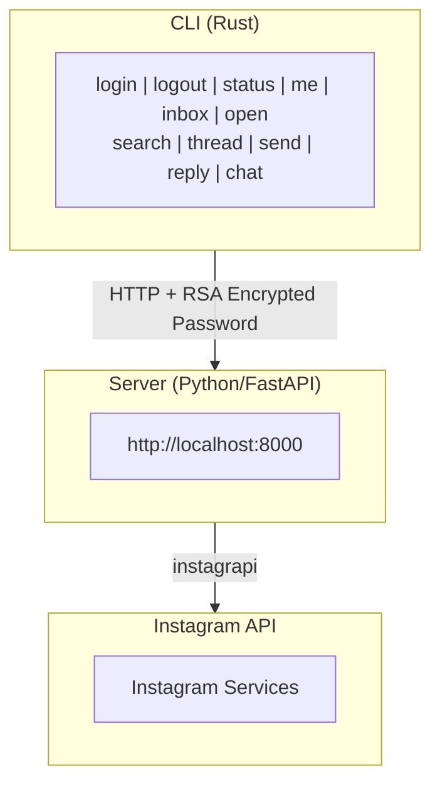
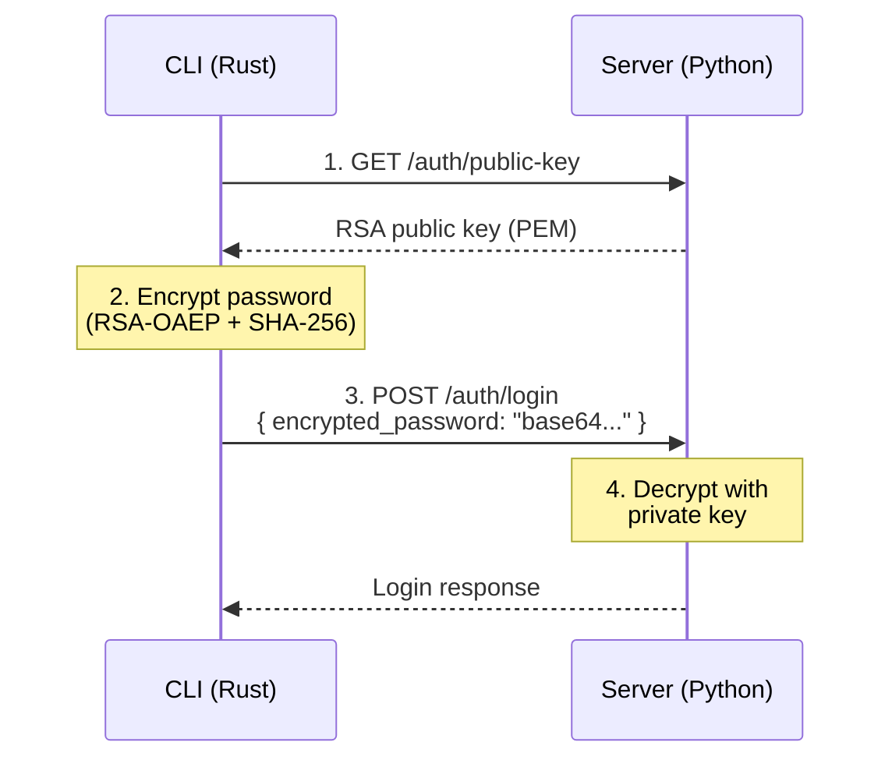

<div align="center">

# Instagram Direct Messages from your terminal

https://github.com/user-attachments/assets/ce7b1668-172e-4813-a63c-13121f9e636b

<pre>
╔══════════════════════════════════════════╗
║                                          ║
║   ▀█▀ █▀▀   █▀▄ █▀█▀█   █▀▀ █   ▀█▀      ║
║    █  █ █   █ █ █ ▀ █   █   █    █       ║
║   ▀▀▀ ▀▀▀   ▀▀  ▀   ▀   ▀▀▀ ▀▀▀ ▀▀▀      ║
║                                          ║
║       Instagram Direct Messages          ║
║            from your terminal            ║
║                                          ║
╚══════════════════════════════════════════╝
</pre>

</div>

## Architecture



## Security

- **RSA-2048 encryption** for password transmission
- **OAEP padding with SHA-256** (industry standard)
- Server generates key pair on first run (stored in `.keys/`)
- CLI fetches public key, encrypts password before sending

#### RSA Encryption Flow



## CLI Commands

### Authentication

| Command                        | Description                                         |
| ------------------------------ | --------------------------------------------------- |
| `ig login`                     | Interactive login (prompts for username & password) |
| `ig login -u <username>`       | Login with username, prompt for password            |
| `ig login -u <user> -p <pass>` | Login with credentials (non-interactive)            |
| `ig logout`                    | Logout and clear session                            |
| `ig status`                    | Check server status and auth state                  |
| `ig me`                        | Show current logged-in user info                    |

**Example:**

```bash
$ ig login
Instagram Login
━━━━━━━━━━━━━━━━━━━━━━━━━━━━━━━━━━━━━━━━
Your password will be encrypted before transmission.

Username: bg_jocker
Password: [hidden]

Authenticating...
✓ Login successful!
  Logged in as: bg_jocker (BG Jocker)
```

### Inbox

| Command          | Description                            |
| ---------------- | -------------------------------------- |
| `ig inbox`       | Show inbox (default: 20 conversations) |
| `ig inbox -l 50` | Show 50 conversations                  |
| `ig inbox -u`    | Show only unread conversations         |
| `ig open <n>`    | Open chat by inbox number (1, 2, 3...) |

**Example:**

```bash
$ ig inbox
Fetching inbox...

Inbox
━━━━━━━━━━━━━━━━━━━━━━━━━━━━━━━━━━━━━━━━━━━━━━━━━━━━━━━━━━━━
  1. Phyu Sin Htet @phyu_sin_htett 17d
     └ Hello Sis Testing
  2. SawLynn @s4wlynn 13d
     └ Hello Bro
  3. Aung Nanda Oo @nikki_aung 18d
     └ Hello
━━━━━━━━━━━━━━━━━━━━━━━━━━━━━━━━━━━━━━━━━━━━━━━━━━━━━━━━━━━━
Showing 3 conversations

$ ig open 1
# Opens interactive chat with the first conversation (Phyu Sin Htet)
```

### Search Users

| Command               | Description        |
| --------------------- | ------------------ |
| `ig search <query>`   | Search for a user  |
| `ig search @username` | Search by username |

**Example:**

```bash
$ ig search phyu_sin_htett

User Found
━━━━━━━━━━━━━━━━━━━━━━━━━━━━━━━━━━━━━━━━━━━━
  Username: @phyu_sin_htett
  Name: Phyu Sin Htet
  Account: Private
  Followers: 1.2K
  Following: 500

Send message: ig send phyu_sin_htett -m "Hello!"
```

### Sending Messages

| Command                          | Description                       |
| -------------------------------- | --------------------------------- |
| `ig send <username>`             | Send message (interactive prompt) |
| `ig send <username> -m "text"`   | Send message directly             |
| `ig reply <thread_id>`           | Reply to thread (interactive)     |
| `ig reply <thread_id> -m "text"` | Reply directly                    |
| `ig chat <username>`             | Interactive chat mode             |

**Example - Single message:**

```bash
$ ig send phyu_sin_htett -m "Hello!"
Sending to @phyu_sin_htett...
✓ Message sent to @phyu_sin_htett
```

**Example - Interactive chat:**

```bash
$ ig chat s4wlynn
Chat with @s4wlynn
Type your messages. Empty line to exit.

> Hey, how are you?
✓ Sent
> Let's catch up soon!
✓ Sent
>
Exiting chat mode.
```

### Viewing Threads

| Command                       | Description               |
| ----------------------------- | ------------------------- |
| `ig thread <thread_id>`       | View messages in a thread |
| `ig thread @username`         | View messages by username |
| `ig thread <thread_id> -l 50` | View 50 messages          |

**Example:**

```bash
$ ig thread @phyu_sin_htett
Finding conversation with @phyu_sin_htett...

Conversation with: phyu_sin_htett
━━━━━━━━━━━━━━━━━━━━━━━━━━━━━━━━━━━━━━━━━━━━━━━━━━━━━━━━━━━━
You 17d
  Hello Sis Testing

phyu_sin_htett 17d
  Hello!
━━━━━━━━━━━━━━━━━━━━━━━━━━━━━━━━━━━━━━━━━━━━━━━━━━━━━━━━━━━━
```

### Global Options

| Option               | Description                                        |
| -------------------- | -------------------------------------------------- |
| `-s, --server <URL>` | Custom server URL (default: http://localhost:8000) |
| `-h, --help`         | Show help                                          |
| `-V, --version`      | Show version                                       |

## Server API Endpoints

| Method | Endpoint            | Description                            |
| ------ | ------------------- | -------------------------------------- |
| GET    | `/health`           | Server status and auth state           |
| GET    | `/auth/public-key`  | RSA public key for encryption          |
| POST   | `/auth/login`       | Login (encrypted_password or password) |
| POST   | `/auth/logout`      | Logout                                 |
| GET    | `/inbox`            | List conversations                     |
| GET    | `/thread/{id}`      | Get thread messages                    |
| POST   | `/thread/{id}/send` | Send to thread                         |
| POST   | `/send/{username}`  | Send to user                           |
| GET    | `/user/{username}`  | Search user                            |

## Project Structure

```
insta_cli/
├── cli/                          # Rust CLI
│   ├── Cargo.toml
│   └── src/
│       ├── main.rs               # CLI entry point & commands
│       ├── client.rs             # HTTP client
│       ├── crypto.rs             # RSA encryption
│       ├── models.rs             # API data types
│       └── commands/
│           ├── mod.rs
│           ├── auth.rs           # login, logout, status
│           ├── inbox.rs          # inbox, thread
│           └── send.rs           # send, reply, chat
│
├── server/                       # Python FastAPI server
│   ├── main.py                   # API endpoints
│   ├── crypto.py                 # RSA key management
│   ├── instagram.py              # Instagram client wrapper
│   └── models/                   # Pydantic models
│
└── Update.md                     # This file
```

## Installation

```bash
# Build CLI
cd cli
cargo build --release

# Install globally as 'ig'
cp target/release/insta-cli ~/.local/bin/ig

# Start server
cd ../server
python main.py
```
